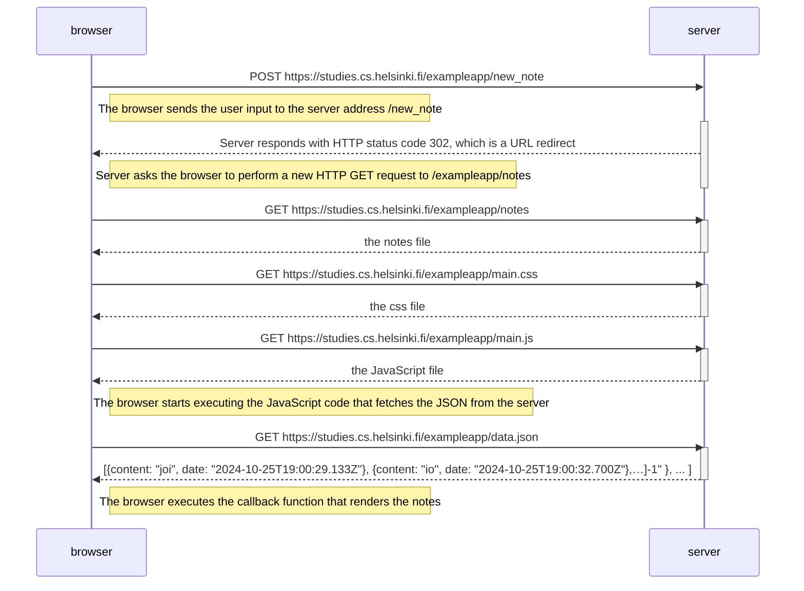

```mermaid

sequenceDiagram
participant browser
participant server

    browser->>server: POST https://studies.cs.helsinki.fi/exampleapp/new_note

    Note right of browser: The browser sends the user input to the server address /new_note

    activate server
    server-->>browser: Server responds with HTTP status code 302, which is a URL redirect

    Note right of browser: Server asks the browser to perform a new HTTP GET request to /exampleapp/notes
    deactivate server

    browser->>server: GET https://studies.cs.helsinki.fi/exampleapp/notes
    activate server
    server-->>browser: the notes file
    deactivate server

    browser->>server: GET https://studies.cs.helsinki.fi/exampleapp/main.css
    activate server
    server-->>browser: the css file
    deactivate server

    browser->>server: GET https://studies.cs.helsinki.fi/exampleapp/main.js
    activate server
    server-->>browser: the JavaScript file
    deactivate server

    Note right of browser: The browser starts executing the JavaScript code that fetches the JSON from the server

    browser->>server: GET https://studies.cs.helsinki.fi/exampleapp/data.json
    activate server
    server-->>browser: [{content: "joi", date: "2024-10-25T19:00:29.133Z"}, {content: "io", date: "2024-10-25T19:00:32.700Z"},…]-1" }, ... ]
    deactivate server

    Note right of browser: The browser executes the callback function that renders the notes
```
